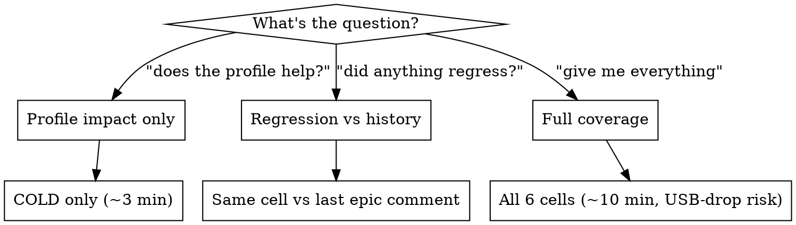

Project-local skill for running `:benchmark`'s `StartupBenchmark` and reading the comparison cleanly. Companion to `benchmark/README.md` (the long-form workflow doc).

**Announce at start:** "I'm using the run-startup-bench skill to run the macrobench and compare cells."

## When to use

Trigger on any of:

- "Run the startup bench" / "run macrobench" / "kick off the startup tests"
- "Measure the profile's impact" / "is the baseline profile working"
- "Compare bench results" / "is COLD startup faster than before"
- "Regenerate the baseline profile" (the gen task — different command but same device hygiene)

If the user wants `FeedScrollBenchmark` instead, do NOT use this skill — that bench needs the asset-backed fake (`nubecita-crmi.5` epic) which isn't shipped yet.

## Pre-flight (always)

The two most expensive failure modes of `:benchmark` runs eat ~5–15 min each. Run all four before any bench command:

1. **Device connected, single instance.**
   ```bash
   adb devices -l
   ```
   If a Pixel Tablet or other secondary device shows up over TCP (Wi-Fi ADB auto-pair), `adb disconnect <ip:port>` it — multi-device confuses gradle's picker and the next test fails with "No connected devices!".

2. **Stay-awake on USB** (prevents mid-run sleep that drops ADB):
   ```bash
   adb -s <serial> shell settings put global stay_on_while_plugged_in 7
   ```

3. **Pin the serial in the gradle invocation:**
   ```
   -Pandroid.testInstrumentationRunnerArguments.androidx.benchmark.targetDeviceSerial=<serial>
   ```

4. **If running the profile generator, sign in first.** The generator drives the signed-in cold-start path and fails fast if Splash routes to Login. The bench (not the generator) wipes app data on each run — sign-in does NOT need to persist for the bench, only for the gen task.

## Decide what to run



Default to **COLD only** when iterating — under the USB-drop threshold and answers the most-asked question.

## Commands

**Generate the baseline profile** (gen task — *needs signed-in device*):

```bash
./gradlew :app:generateReleaseBaselineProfile
```

Then commit `app/src/release/generated/baselineProfiles/{startup,baseline}-prof.txt` if the diff is meaningful.

**Run StartupBenchmark — COLD cells only** (recommended default):

```bash
./gradlew :benchmark:connectedBenchmarkReleaseAndroidTest \
  -Pandroid.testInstrumentationRunnerArguments.class=net.kikin.nubecita.benchmark.StartupBenchmark \
  -Pandroid.testInstrumentationRunnerArguments.tests_regex='startup.COLD.*' \
  -Pandroid.testInstrumentationRunnerArguments.androidx.benchmark.targetDeviceSerial=<serial>
```

**Run StartupBenchmark — all cells except the broken HOT** (when you need WARM too):

```bash
./gradlew :benchmark:connectedBenchmarkReleaseAndroidTest \
  -Pandroid.testInstrumentationRunnerArguments.class=net.kikin.nubecita.benchmark.StartupBenchmark \
  -Pandroid.testInstrumentationRunnerArguments.tests_regex='startup.(COLD|WARM).*' \
  -Pandroid.testInstrumentationRunnerArguments.androidx.benchmark.targetDeviceSerial=<serial>
```

Filter HOT out — it's a known pre-existing failure (`nubecita-vuny`), not related to the profile.

## Read results

```bash
python3 -c "
import json, sys
data = json.load(open(sys.argv[1]))
for b in data['benchmarks']:
    if b['className'].endswith('StartupBenchmark'):
        m = b['metrics'].get('timeToInitialDisplayMs')
        if m:
            print(f\"{b['name']:32s} TTID median={m['median']:7.2f} ms  CoV={m['coefficientOfVariation']*100:.1f}%\")
" "benchmark/build/outputs/connected_android_test_additional_output/benchmarkRelease/connected/<device>/net.kikin.nubecita.benchmark-benchmarkData.json"
```

The device dir name is the literal `adb shell getprop ro.product.marketname` plus API level, e.g. `Pixel 10 Pro XL - 16`. `ls` the parent to find it.

## Interpret

- **Profile impact** = `COLD-None` median minus `COLD-BaselineProfile` median **from the same run**. Positive delta = profile is helping. Target band: 15–30 % reduction.
- **Regression check** = today's `COLD-BaselineProfile` median vs the last value posted to the `nubecita-crmi` epic comment thread. Same-cell comparison is the only kind that survives thermal / OS-version drift.
- **CoV** (coefficient of variation) ≥ 15 % means rerun on a cooler device — the median is too noisy to trust small deltas.

Never compare a `None` from one run to a `BaselineProfile` from another run — that conflates two independent sources of variance.

## Log to the epic

Append a single comment to the `nubecita-crmi` epic (`bd comments nubecita-crmi`):

```
<YYYY-MM-DD> Pixel 10 Pro XL — :app:benchmarkRelease

COLD-None             median XXX.XX ms  (CoV X.X%)
COLD-BaselineProfile  median XXX.XX ms  (CoV X.X%)
WARM-None             median XXX.XX ms  (CoV X.X%) — optional
WARM-BaselineProfile  median XXX.XX ms  (CoV X.X%) — optional

Context: <what changed — feature merges, dependency bumps, regen of the
startup profile, etc.>
```

This historical log is the only way to detect slow drift across releases.

## Common mistakes

| Mistake | Fix |
|--------|-----|
| Comparing today's `None` to yesterday's `BaselineProfile` | Same-cell, same-run only. Always. |
| Reading the regression as the profile's effect | If today's `BaselineProfile` is slower than yesterday's `BaselineProfile`, that's a regression — not a profile failure. Same-cell across runs. |
| Reporting a single number | Report the median AND the CoV. A 5 % delta at 20 % CoV is noise. |
| Filtering out HOT silently | Mention `nubecita-vuny` so the reader knows the omission is deliberate. |
| Running on an emulator | Macrobench numbers from emulators are 30–50 % noisier than physical. Always use a real device for tracked numbers. |

## Reference

Long-form workflow doc: `benchmark/README.md` — covers the bench setup, regen cadence, profile-bundling verification (`unzip -l` + `pm dump`), and the install-cycle-wipes-data behavior.
